```{r}
#| label: setup
#| include: false
library(tidyverse)
library(knitr)
data_atlas <- readr::read_csv("data/data-bersih/atlas_sulsel.csv", show_col_types = FALSE)
```

::: {.hero-note}
**TIM 1**  
NATHANIA OKTAVIA GUNAWAN · H062261002  
DHIYA IZDIHAR HARYADI · H062261003

Atlas ini menyajikan dua indikator yang saling melengkapi: Indeks Pembangunan Manusia (IPM) sebagai gambaran capaian pembangunan manusia dan persentase penduduk miskin sebagai konteks kesejahteraan ekonomi. Fokus pembacaan adalah perubahan antarwaktu dan perbedaan antarwilayah, bukan sekadar urutan peringkat.
:::

# Intisari

Data mencakup **`24` kabupaten/kota selama tiga tahun (`2022–2024`)** atau `72` observasi wilayah-tahun. Secara agregat, rata-rata IPM meningkat dari `73,13` pada `2022` menjadi `74,49` pada `2024`. Pada periode yang sama, rata-rata persentase penduduk miskin turun dari `9,32%` menjadi `8,60%`. Perubahan rata-rata ini memberi gambaran umum, tetapi tidak berarti setiap wilayah mengalami perubahan dengan besaran atau arah yang sama.

```{r}
#| label: ringkasan-indikator
ringkasan <- data_atlas |>
  group_by(tahun) |>
  summarise(
    `Rata-rata IPM` = mean(ipm, na.rm = TRUE),
    `Rata-rata penduduk miskin (%)` = mean(kemiskinan, na.rm = TRUE),
    .groups = "drop"
  ) |>
  mutate(
    `Rata-rata IPM` = round(`Rata-rata IPM`, 2),
    `Rata-rata penduduk miskin (%)` = round(`Rata-rata penduduk miskin (%)`, 2)
  )
knitr::kable(ringkasan, align = "c", caption = "Ringkasan rata-rata indikator per tahun")
```

::: {.callout-note}
**Cara membaca atlas.** Gunakan grafik untuk melihat distribusi dan pola, peta untuk memahami konteks geografis, profil untuk menelusuri wilayah tertentu, serta interval bootstrap dan lineup untuk membaca ketidakpastian. Pola visual menunjukkan asosiasi, bukan bukti sebab-akibat.
:::

# Dari grafik awal ke desain yang lebih informatif

Makeover mengutamakan hierarki informasi yang jelas, label yang langsung menjelaskan pesan, dan penekanan warna yang terbatas. Grafik awal dan hasil perbaikan ditampilkan berdampingan agar alasan perubahan desain dapat dievaluasi.

::: {.grid-2}
::: {.panel-card}
### Sebelum
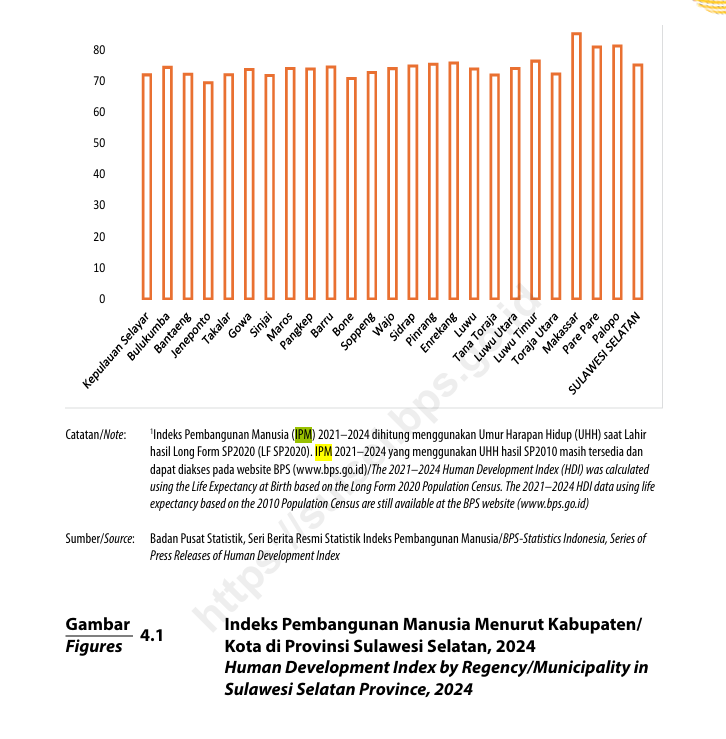{fig-alt="Grafik IPM sebelum makeover"}
:::
::: {.panel-card}
### Sesudah
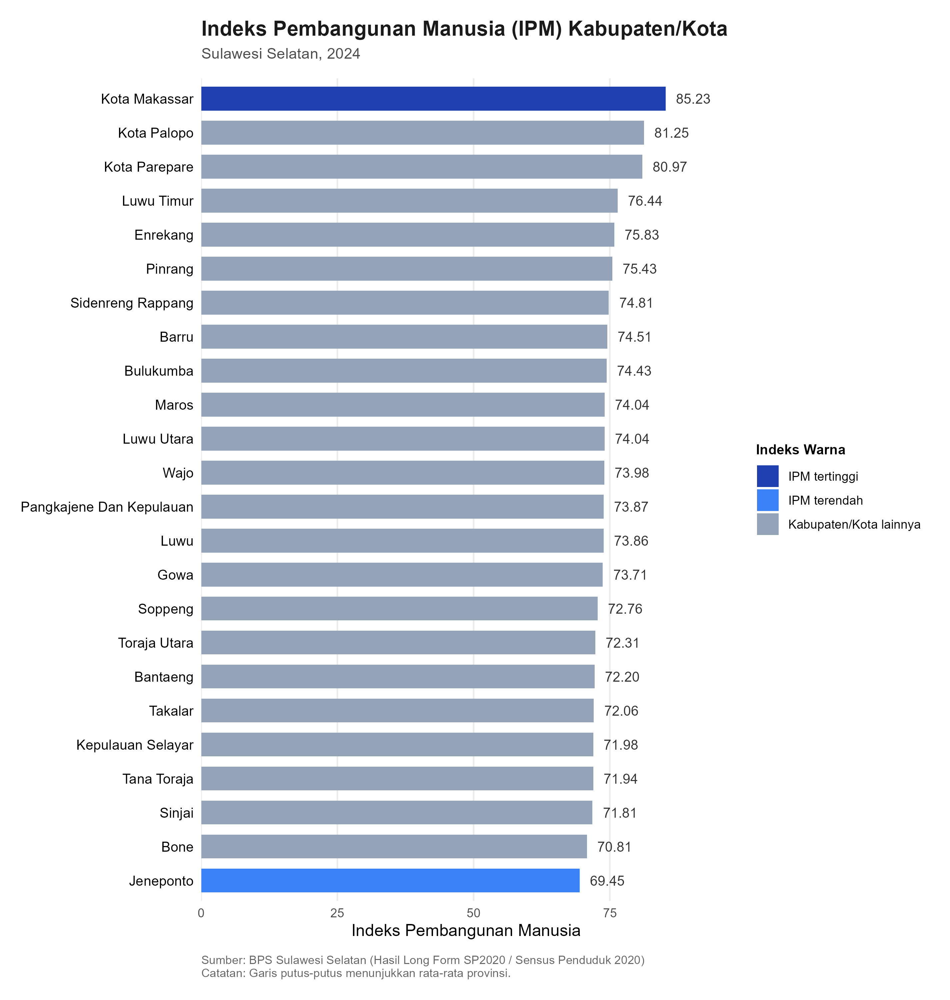{fig-alt="Grafik IPM sesudah makeover"}
:::
:::

**Prinsip desain:** kurangi elemen dekoratif yang tidak membantu pembacaan, gunakan warna secara konsisten, perjelas judul dan sumber, serta pertahankan konteks pembanding. Palet dan tema khusus proyek disimpan di `R/04_theme_palet_tim.R` agar dapat digunakan kembali.

# Galeri Statistik

Galeri berikut memadukan distribusi, perubahan waktu, hubungan dua indikator, peringkat, dan ringkasan multipanel. Setiap grafik menjawab pertanyaan yang berbeda; karena itu, satu grafik tidak diperlakukan sebagai pengganti seluruh analisis.

## 1. Sebaran IPM

Grafik ini membantu membandingkan rentang dan variasi IPM antardaerah selama periode pengamatan.

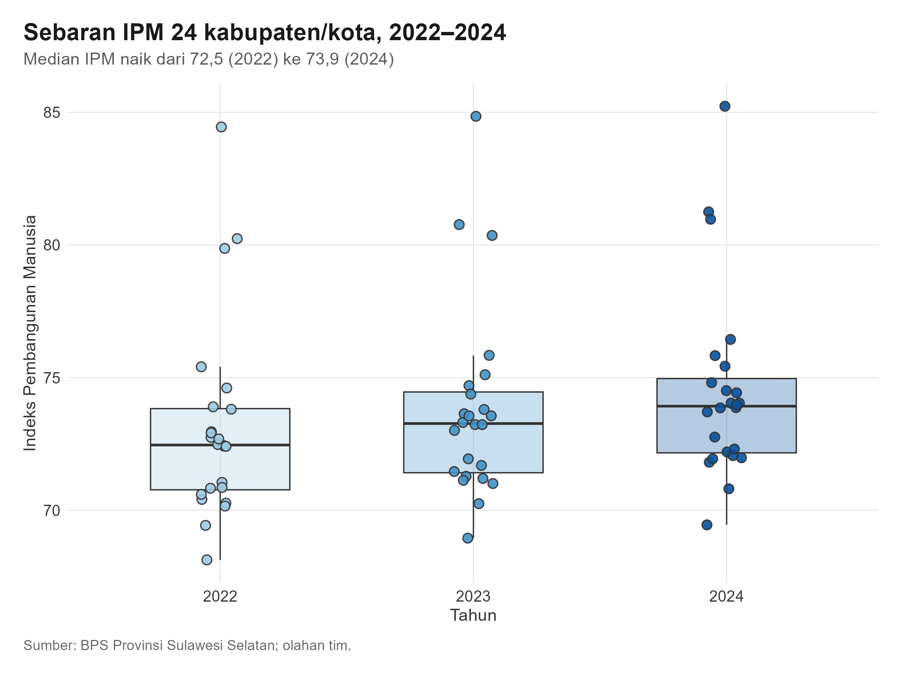{fig-alt="Sebaran IPM kabupaten/kota Sulawesi Selatan 2022–2024"}

## 2. Perubahan IPM Antarwaktu

Grafik tren menempatkan tahun sebagai urutan waktu sehingga perubahan tiap wilayah lebih mudah ditelusuri daripada hanya membandingkan satu tahun.

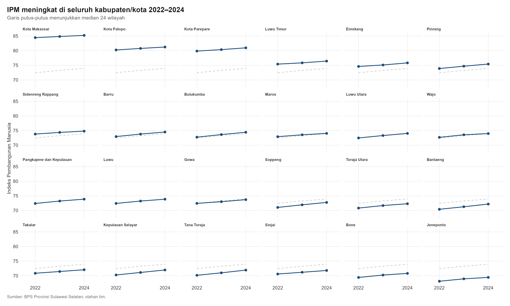{fig-alt="Tren IPM kabupaten/kota Sulawesi Selatan 2022–2024"}

## 3. Hubungan IPM dan Kemiskinan

Titik mewakili kabupaten/kota, sedangkan bentuk membedakan kelompok kabupaten dan kota. Garis tren membantu merangkum arah hubungan linear. Hubungan negatif yang tampak pada grafik perlu dibaca sebagai asosiasi deskriptif; faktor lain dan struktur tiap wilayah tidak dikendalikan oleh grafik ini.

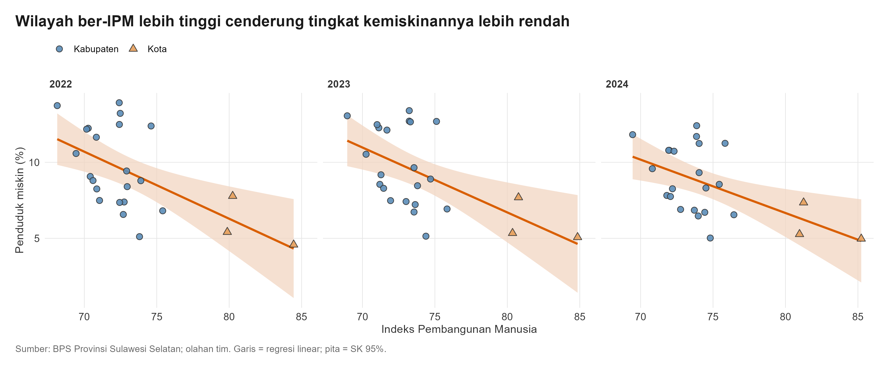{fig-alt="Hubungan IPM dan persentase penduduk miskin"}

## 4. Peringkat IPM

Peringkat menonjolkan posisi relatif wilayah, tetapi selisih nilai antarwilayah tetap perlu diperhatikan. Perubahan urutan kecil tidak selalu berarti perubahan capaian yang besar.

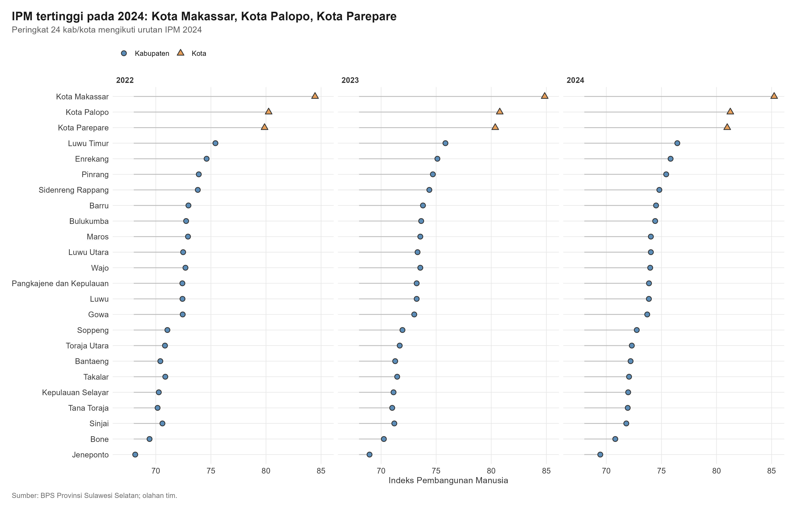{fig-alt="Peringkat IPM kabupaten/kota"}

## 5. Ringkasan Multipanel

Multipanel merangkum beberapa sudut pandang dalam satu halaman. Baca tiap panel sesuai judul dan sumbu; hindari membandingkan jarak visual antarpanel bila skala sumbunya berbeda.

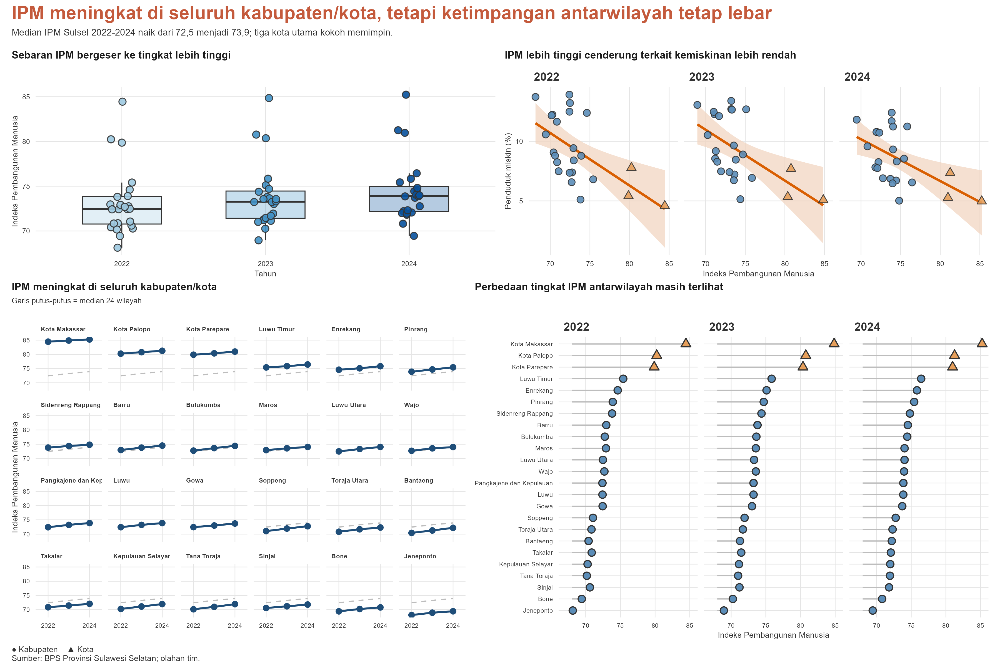{fig-alt="Ringkasan multipanel indikator IPM dan kemiskinan"}

# Peta: Melihat Konteks Wilayah

Peta membantu mengenali pola spasial yang tidak selalu terlihat pada tabel peringkat. Data batas administratif bersumber dari geoBoundaries ADM2 yang telah disederhanakan untuk kebutuhan visualisasi. Peta koroplet menunjukkan variasi nilai indikator, bukan batas sebab-akibat atau penjelasan mengapa suatu wilayah memiliki nilai tertentu.

::: {.grid-2}
::: {.panel-card}
### IPM
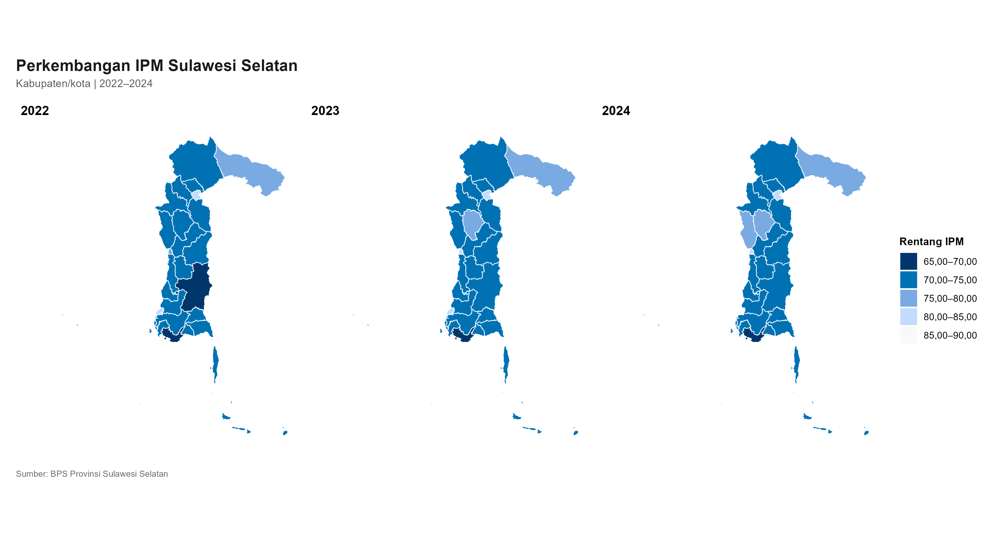{fig-alt="Peta IPM Sulawesi Selatan 2022–2024"}
:::
::: {.panel-card}
### Penduduk Miskin
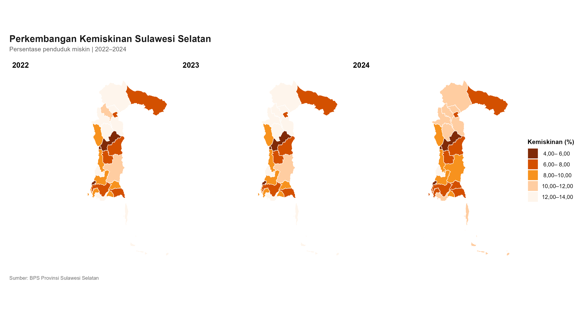{fig-alt="Peta persentase penduduk miskin Sulawesi Selatan 2022–2024"}
:::
:::

## Pemeriksaan Aksesibilitas Warna

Versi pemeriksaan palet untuk tahun `2024` disertakan sebagai bahan evaluasi keterbedaan warna. Peta tematik sebaiknya tidak mengandalkan warna saja: legenda, label, dan konteks tahun tetap penting bagi pembaca dengan persepsi warna yang berbeda.

::: {.grid-2}
::: {.panel-card}
### IPM · 2024
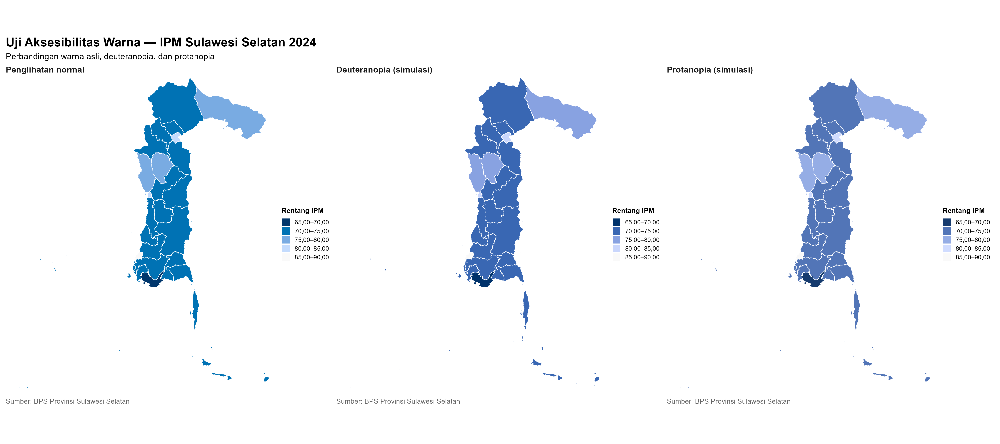{fig-alt="Pemeriksaan palet peta IPM tahun 2024"}
:::
::: {.panel-card}
### Penduduk Miskin · 2024
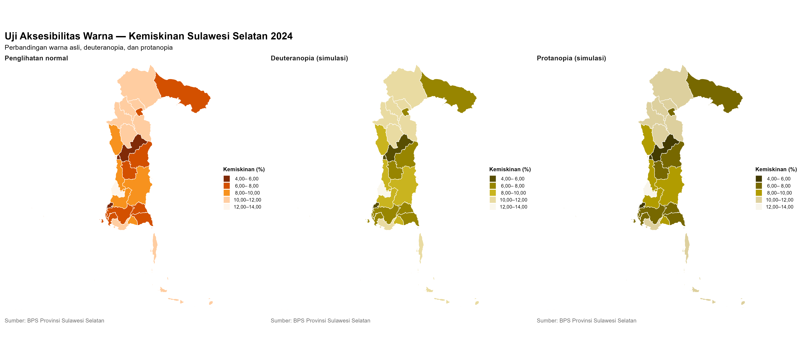{fig-alt="Pemeriksaan palet peta kemiskinan tahun 2024"}
:::
:::

# Jelajahi 24 Kabupaten/kota

Profil wilayah menggabungkan informasi IPM dan kemiskinan untuk membantu pembaca beralih dari gambaran provinsi ke konteks lokal. Gunakan profil sebagai ringkasan eksploratif, bukan sebagai penilaian tunggal atas keberhasilan pembangunan.

```{r}
#| label: profil-wilayah
#| results: asis
wilayah <- sort(unique(data_atlas$kabupaten_kota))
for (w in wilayah) {
  slug <- stringr::str_replace_all(stringr::str_to_lower(w), "[^a-z0-9]+", "_")
  cat("\n### ", stringr::str_to_title(w), "\n\n", sep = "")
  cat("{fig-alt=\"Profil ", stringr::str_to_title(w), "\"}\n\n", sep = "")
}
```

# Ketidakpastian: Interval Bootstrap

Interval bootstrap `95%` menggunakan **`B = 1.999` replikasi** replikasi untuk merangkum variasi estimasi rata-rata indikator berdasarkan pengambilan ulang sampel. 
::: {.grid-2}
::: {.panel-card}
### IPM
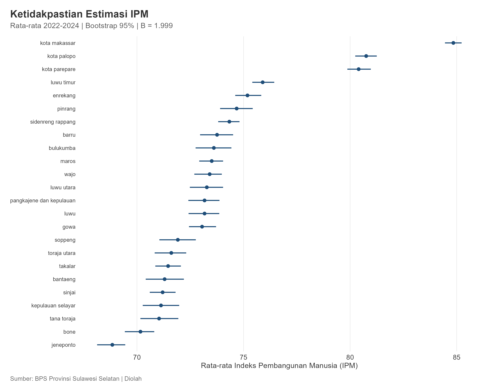{fig-alt="Grafik bootstrap IPM"}
:::
::: {.panel-card}
### Penduduk Miskin
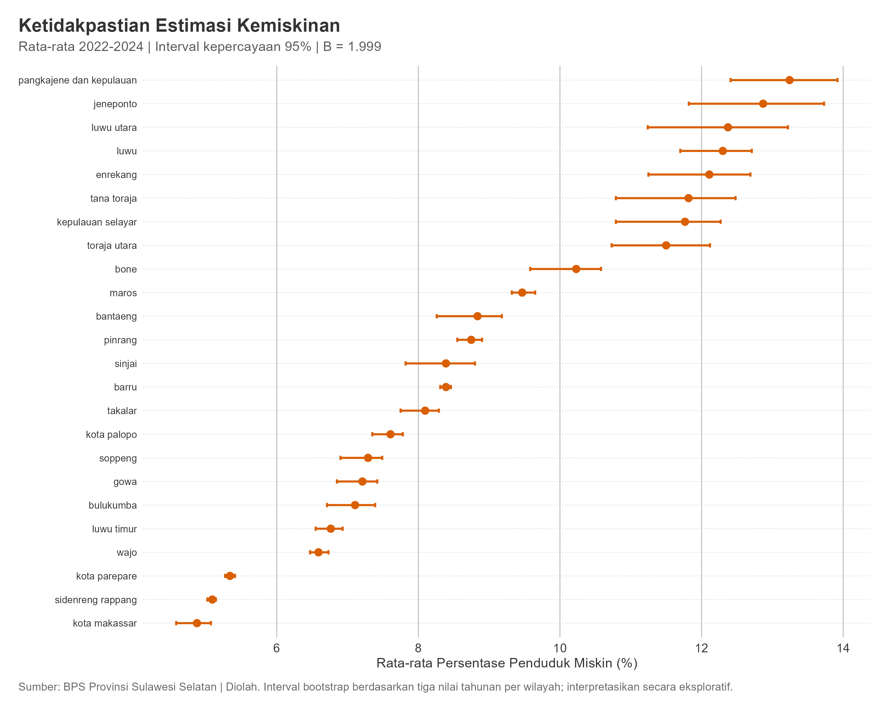{fig-alt="Autoplot interval bootstrap persentase penduduk miskin 2022–2024"}
:::
:::

Grafik autoplot() menggunakan metode S3 untuk menampilkan estimasi titik dan error bar, dengan interval yang lebih lebar menunjukkan variasi estimasi yang lebih besar dalam prosedur bootstrap.

# Inferensi Visual: Lineup

Lineup berisi `20` panel: satu panel data asli dan `19` panel hasil permutasi/null. Pengamat diminta memilih panel yang tampak paling berbeda. Pendekatan ini mengevaluasi apakah pola data asli cukup menonjol dibandingkan pola yang mungkin muncul secara acak.

{fig-alt="Lineup 20 panel untuk hubungan IPM dan kemiskinan"}

```{r}
#| label: hasil-lineup
#| include: false
hasil_lineup <- readr::read_csv("keluaran/analisis_lineup/hasil_lineup.csv", show_col_types = FALSE)
```

Berdasarkan ringkasan analisis yang tersimpan, **`6` dari `10` pengamat** memilih panel asli. Dengan peluang tebak acak `1/20`, nilai p visual yang tercatat sekitar **`2,75 × 10⁻⁶`**. Hasil ini mendukung bahwa pola pada panel asli cukup mudah dibedakan dalam lineup tersebut, tetapi kesimpulan tetap bergantung pada desain lineup dan jumlah pengamat.

Berkas jawaban dan ringkasan analisis disimpan di `data/jawaban_lineup.csv` dan `keluaran/analisis_lineup/`. Berkas kunci panel asli disimpan terpisah di `keluaran/kunci_lineup/kunci.rds` agar tidak tercampur dengan jawaban pengamat.

# Fungsi dan Reproduksibilitas

Analisis disusun dalam skrip terpisah agar proses pembersihan data, persiapan peta, makeover, tema, galeri, profil, lineup, bootstrap, dan `autoplot()` dapat ditelusuri. Skrip utama berada di folder `R/`.

Urutan kerja yang disarankan dari direktori utama proyek:

1. Jalankan `R/01_membersihkan_data.R` untuk membangun data bersih.
2. Jalankan `R/02_menyiapkan_peta.R` untuk menyiapkan keluaran spasial.
3. Jalankan skrip tema dan galeri sesuai kebutuhan (`R/04_theme_palet_tim.R`, `R/05_galeri.R`).
4. Jalankan `R/06_fungsi grafik dan Lineup.R` dan `R/08_analisis lineup.R` untuk fungsi serta analisis lineup.
5. Jalankan `R/09_bootstrap.R` sebelum `R/10_autoplot.R` untuk memperbarui hasil ketidakpastian.
6. Render `atlas.qmd` menggunakan Quarto dari direktori utama proyek.

Data bersih mencakup `72` baris dan `24` wilayah untuk tiga tahun. Sebelum menjalankan ulang, pastikan paket yang dipakai telah terpasang dan seluruh skrip dijalankan dari direktori proyek agar path relatif tetap sesuai.

# Keterbatasan

- Periode tiga tahun memberi gambaran awal, tetapi belum cukup untuk menyimpulkan tren jangka panjang.
- Korelasi dan garis regresi pada grafik hubungan bersifat deskriptif; keduanya tidak membuktikan pengaruh kausal.
- Estimasi bootstrap merangkum ketidakpastian menurut prosedur pengambilan ulang yang digunakan, tetapi hasilnya tetap dipengaruhi struktur dan ukuran data.
- Lineup menggunakan `10` respons pengamat pada berkas yang tersedia. Penambahan pengamat dan dokumentasi prosedur pengamatan akan memperkuat evaluasi inferensi visual.
- Batas wilayah, definisi indikator, serta tahun rujukan perlu diperiksa kembali jika sumber data diperbarui.

# Deklarasi Penggunaan AI

AI generatif digunakan sebagai alat bantu untuk penyuntingan bahasa, penataan struktur narasi, dan dukungan teknis dalam penyusunan dokumen. Pemilihan indikator, pemeriksaan data, keputusan analisis, verifikasi keluaran, dan tanggung jawab atas isi akhir tetap berada pada anggota Tim 1. Seluruh angka dan visual perlu dicocokkan dengan berkas sumber sebelum pengumpulan.

# Sumber Data

- **Badan Pusat Statistik Provinsi Sulawesi Selatan** — data Indeks Pembangunan Manusia dan persentase penduduk miskin, `2022–2024`.
- **geoBoundaries** — batas administratif ADM2 yang disederhanakan untuk visualisasi. Keterangan penggunaan terdapat pada `data/data-batas-peta/CITATION-AND-USE-geoBoundaries.txt`.

# Repositori GitHub

Skrip R, struktur proyek, dan berkas pendukung pengembangan atlas dapat ditelusuri melalui repositori GitHub Tim 1.

<div class="github-card">
  <div class="github-card-icon" aria-hidden="true">GH</div>
  <div class="github-card-content">
    <strong>Atlas Visual Sulawesi Selatan · Tim 1</strong>
    <p>Kode sumber, skrip analisis, dan berkas proyek.</p>
    <a href="https://github.com/nathaniaoktaviag26h-oss/Atlas-Visual-Sulsel.git" target="_blank" rel="noopener noreferrer">Buka repositori di GitHub ↗</a>
  </div>
</div>

---

<div class="footer-note">Atlas Visual Sulawesi Selatan · Tim 1 · Komputasi Statistika Lanjut · 2026</div>
